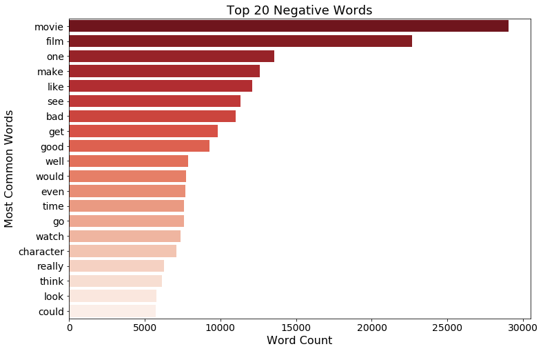
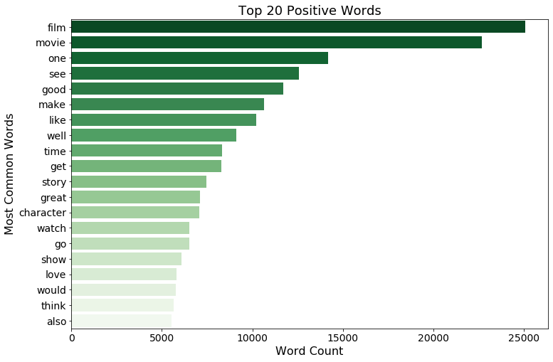
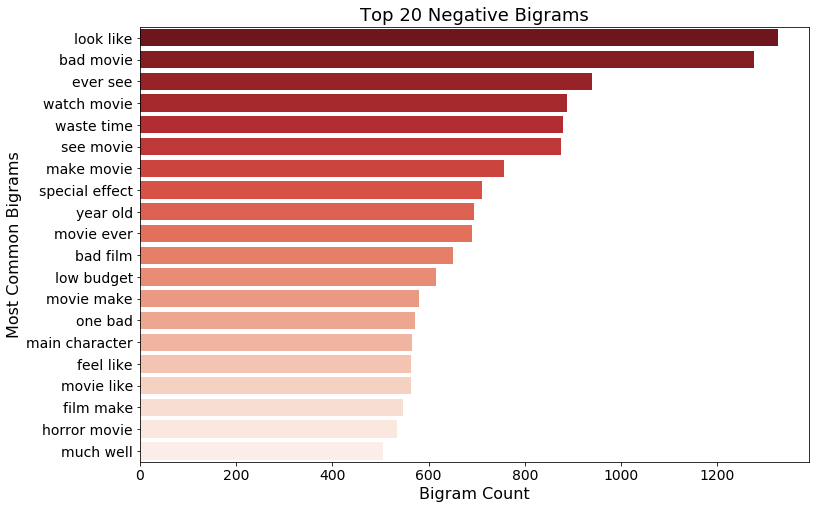
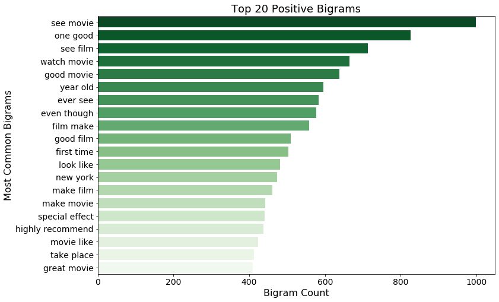
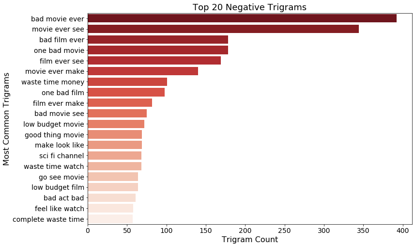
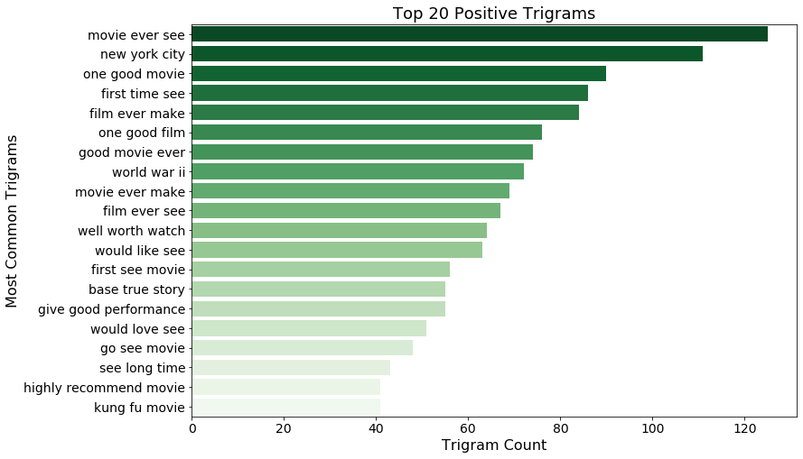

# mod_4_final_project

## Intro:
Take this fundamental business premise: Customers have demands. Businesses supply customer demands. Therefore if a business can identify what customers like and dislike, that business can adjust the supply to maximize profits. Simple in theory, difficult in practice. Using Natural Language Processing (NLP) techniques on a collection of imdb movie reviews, this project seeks to classify the sentiment of these reviews as binary indicators of positive and negative reactions to a movie, and to bring to light features of the texts that would give insight into what one might deem “good” and “bad” movies.

## Data/Libraries:
The unedited dataset was compiled by a team of researchers at Stanford University. It is, altogether, a collection of 100k movie reviews split evenly into labeled and unlabeled data. For our purposes, we focused on the the 50k labeled reviews. These 50k reviews are separated into 25k training reviews and 25k testing reviews. For our purposes we performed a train-test-split on the training reviews and used the testing reviews as a holdout set. The team that gathered the data notes, “In the entire collection, no more than 30 reviews are allowed for any given movie because reviews for the same movie tend to have correlated ratings. Further, the train and test sets contain a disjointed set of movies, so no significant performance is obtained by memorizing movie-unique terms and their association with observed labels.” The distribution of data hopefully helps our model generalize to other similar texts such as television or youtube reviews.

Learning Word Vectors for Sentiment Analysis: Proceedings of the 49th Annual Meeting of the Association for Computational Linguistics: Human Language Technologies
http://ai.stanford.edu/~amaas/data/sentiment/
Maas, Andrew L.
Daly, Raymond E.
Pham, Peter T. 
Huang, Dan  
Ng, Andrew Y.  
Potts, Christopher
month     = {June},
year      = {2011},
address   = {Portland, Oregon, USA},
publisher = {Association for Computational Linguistics},
pages     = {142--150},
url       = {http://www.aclweb.org/anthology/P11-1015}

## EDA:
When charting the top twenty most frequent uni-grams in the negative and positive distributions we discovered that  there were many similar words between the negative and positive sets. The words were also very general and not very informative. 

We gained much more insight looking at the bigram and trigram frequencies for the positive and negative reviews. For example, if we consider genres, the bi/tri-grams become very telling and can be related to movie market data. In the positive reviews “kung fu movie”, “base true story”, and “give good performance” correspond with the top 3 genres of adventure, action, and drama, according to total box office numbers from 1995-2020 (https://www.the-numbers.com/market/genres). Kung Fu movies are action/adventure heavy while many dramas are often based on true stories and are very focused on inter and intra personal relationships (which require great acting to sell the believability to an audience). On the opposite end we see word groups like, “horror movie”, “main character”, “sci fi channel”, and “bad act bad”. Sci-Fi movies are not even on the list of top grossing genres while horror movies, although they rank sixth, can obviously be a polarizing genre (as they’re usually meant to shock and disturb viewers). The fact that main character and bad acting show up in the negative reviews also gives credence to peoples’ desire to see “quality” acting which is often associated with dramas (just take a cursory glance at the genres of films that won Academy Awards for best actor). 

## Models:
For this project, three different vectorizing techniques were implemented and tested against each other. In the Bag of Words model, word vectors are created using One-Hot Encoding which creates a sparse matrix where each document’s words are counted and represented in a matrix of all words in the corpus. The TF-IDF model vectorizes based on the product of the term frequency and the inverse document frequency to highlight words that appear infrequently but may illuminate some meaning in the document. The last model we used was the Python library Spacy’s GloVe (Global Vectors) embeddings. Each model was run through Logistic Regression, Naive Bayes, and Random Forest classifiers. Given the dataset’s even distribution of labels we considered 50% accuracy the baseline prediction. While all the models performed fairly well with scores in the high 80’s, we decided on the Spacy model as our final model with an accuracy score of 0.8954 and an F1 score of 0.8958.

## Conclusion:
Through our EDA we found that context was important in regards to extracting the sentiment from reviews. Though we would like to apply this model to other types of text and to attempt stacking models for better performance, this model could give a good sense of how positive a viewership feels about a series or movie. 

## Link to presentation:
https://docs.google.com/presentation/d/1QFsl3sdm7z_90BbsRpa7oIPfkI92GEFv0kB9CvZroyI/edit?usp=sharing
